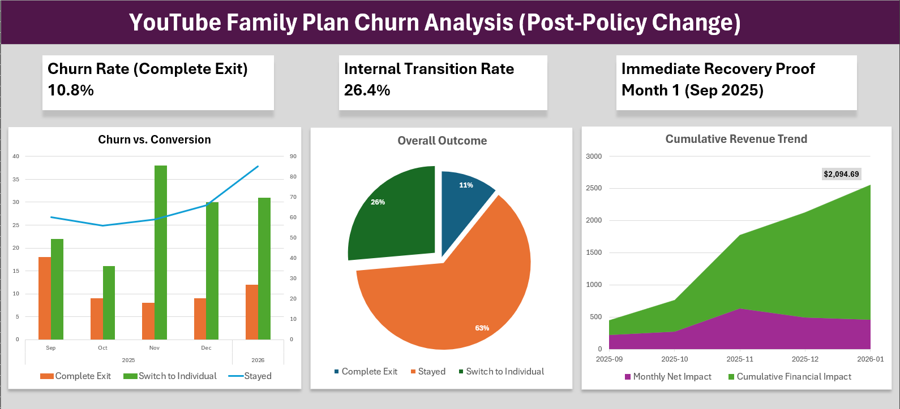
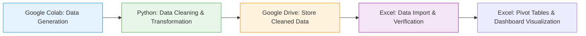
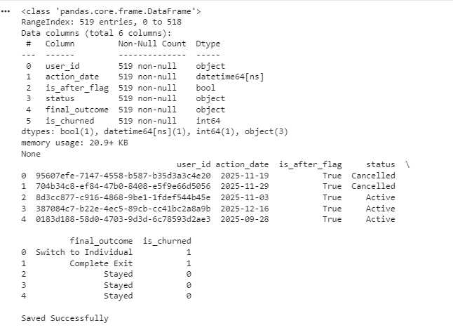
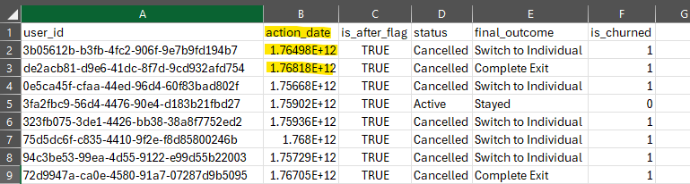
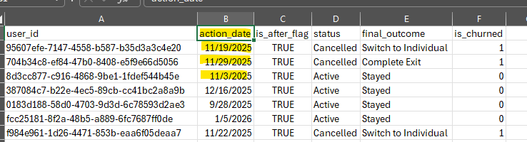
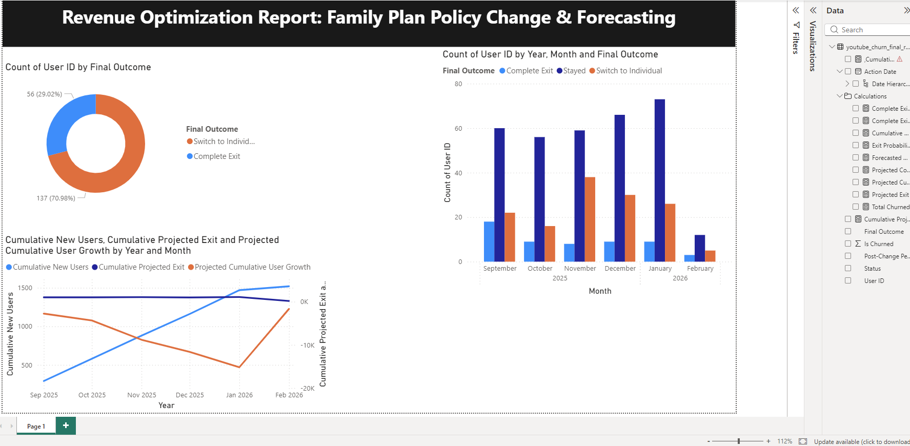
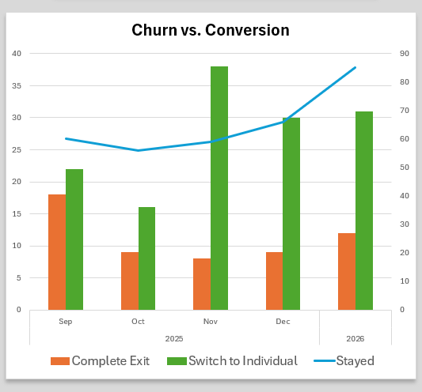
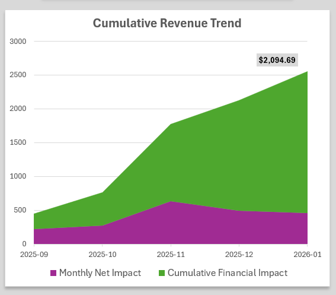

# YouTube Family Plan Policy Chang: Impact Analysis
This project analyzes the gap between social media sentiment and actual user behavior following YouTube's 2025 family plan residency policy update.

  

## 1. Motivation & Hypothesis

My initial hypothesis was that strict residency verification would lead to significant churn.

**Research Hypotheses:**
- **Hypo 1:** Social media backlash translates into measurable churn (>20% within first month)
- **Hypo 2:** Revenue loss from policy enforcement outweighs retention benefits
- **Hypo 3:** User migration to individual plans is minimal (<10%)

**Spoiler:** All three hypotheses were proven wrong by the data.

## 2. Data & Methodology

### **Data Strategy:**
Since YouTube's subscriber data is proprietary, I used AI-assisted Python to generate a realistic synthetic dataset modeling various user responses to the policy change. This approach is increasingly common in data analytics for privacy-sensitive industries and competitive analysis.

### **Development Approach:**
The Python scripts in `/notebooks/` were developed with AI assistance (Claude/ChatGPT), as I'm still building my Python coding skills. However, the analytical direction and technical decisions were human-driven.

### **My Technical Ownership:**
* **Schema Design:** Defined the data structure with key fields (user_id, action_date, is_after_flag, final_outcome) to enable realistic churn scenario modeling
* **Business Logic Validation:** Verified AI-generated code correctly categorized user responses (complete exit vs. plan switch) and applied conservative baseline assumptions  
* **Data Quality Assurance:** Identified and resolved datetime format loss during Colab-to-Excel export, ensuring dashboard calculations worked correctly
* **Results Interpretation:** Analyzed outputs to validate they aligned with real-world business behavior patterns

### **Data Generation:** Created synthetic business dataset using Python in Google Colab

### Data Pipeline Flow
- **Step 1: Data Generation (Python/Colab)** – Generated synthetic business datasets using Python and AI to simulate user response scenarios
- **Step 2: Data Cleaning (Python/Pandas)** – Performed all data transformations, including timestamp normalization and churn flag creation, entirely in Python to ensure data integrity
- **Step 3: Storage (Google Drive)** – Saved the fully cleaned datasets to Google Drive for secure and organized data management
- **Step 4: Visualization (Excel)** – Imported the pre-cleaned data into Excel to build an interactive dashboard using Pivot Tables and Charts

Saved cleaned data to Google Drive, then created exploratory visualizations in Python before moving to Excel.

### Sample Data Structure

  

### Visualization: Built an interactive Excel dashboard to track conversion rates, churn rates, and cumulative revenue trends using pivot tables, charts, and conditional formatting.
### Technical Challenge: 
- When downloading the cleaned dataset from Colab for Excel dashboard creation, datetime formats were lost during the transfer. 
- Implemented additional preprocessing steps to validate and preserve date formatting in pandas before export, ensuring data integrity across platforms.

<table style="width: 100%; border-collapse: collapse;">
  <tr style="border: none;">
    <td align="center" style="border: none; width: 50%;">
      <b>[ Wrong Datetime format during the transfer ]</b> 
      
    </td>
    <td align="center" style="border: none; width: 50%;">
      <b>[ After: Fixed Datetime Format ]</b> 
      
    </td>
  </tr>
</table>

## 3. Assumptions & Parameters
To ensure a conservative and realistic analysis:

- **Pricing**: $15.99/month (base $13.99 + regional taxes/platform fees)
- **Monthly baseline**: 10 new user acquisitions, 4 natural churn (pre-policy behavior)
- **Analysis period**: 5 months (Sep 2025 - Jan 2026)

This approach isolates the policy's true impact from normal subscriber fluctuations.

## 4. Power BI Dashboard
Implemented an interactive dashboard to visualize user churn trends and practice advanced DAX modeling

  

## 5. Key Insights

- **High Retention**: 89.2% of users remained within the YouTube ecosystem, contradicting social media sentiment.
- **Revenue Defense**: 26.4% of affected users downgraded to individual plans rather than leaving entirely, preserving revenue.
- **Positive Financial Impact**: Cumulative revenue reached $2,094.69 over five months post-policy change, with consistent growth from month 1.
- **Low Complete Churn**: Only 11% fully cancelled their subscriptions.
- **Key Learning**: Vocal online reactions are often poor predictors of actual user behavior at scale.

<table style="width: 100%; border-collapse: collapse;">
  <tr style="border: none;">
    <td align="center" style="border: none; width: 50%;">
      <b>[ Wrong Datetime format during the transfer ]</b> 
      
    </td>
    <td align="center" style="border: none; width: 50%;">
      <b>[ After: Fixed Datetime Format ]</b> 
      
    </td>
  </tr>
</table>

## 6. Tools & Technologies

- Python (pandas)
- Google Colab
- Microsoft Excel (pivot tables, charts)
- Power BI (DAX, Data Visualization)

## 7. Future Improvements

- Incorporate pre-policy historical data to enable "before vs. after" comparisons with dynamic time-series slicers
- Add interactive slicers for filtering by outcome type and time period
- Expand dataset to include user demographics and engagement metrics
- Compare this case with other platform policy changes to identify broader patterns

## 8. Limitations

- **Synthetic Data Variability:** The random data generation process produces slightly different results on each run. While specific numbers may vary (e.g., retention rate ranging from 87-91%), the overall trend and business conclusions remain consistent across iterations.
- **Lack of Historical Data:** Due to the absence of pre-policy data, dynamic time-series slicers for comparative analysis could not be implemented in this version. The dashboard currently presents the complete 5-month post-policy period, which effectively demonstrates the policy's impact but limits temporal flexibility.

## 9. Files in This Repository

- **`/data/`** - Synthetic dataset (JSON and cleaned CSV)
- **`/notebooks/`** - Python data generation and cleaning scripts
- **`/images/`** - Dashboard screenshots and visualizations
- **`README.md`** - Project documentation

