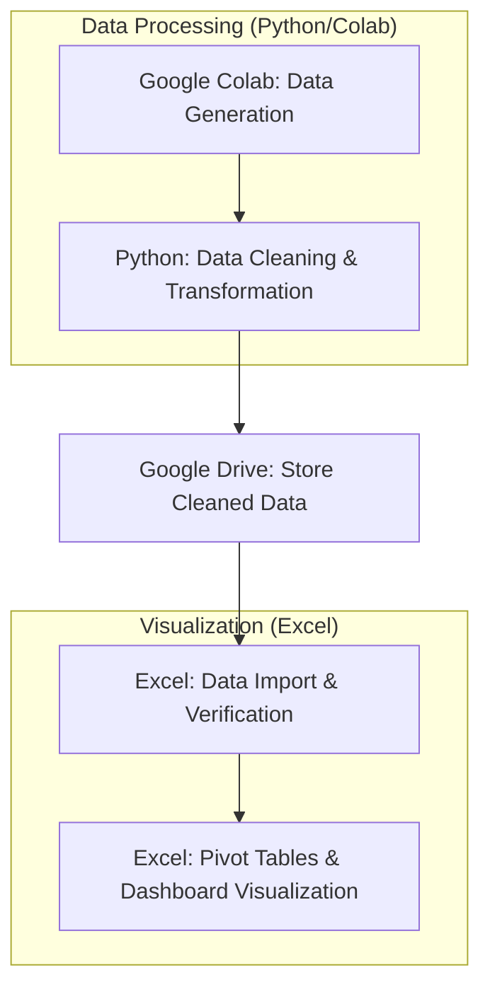

# YouTube Family Plan Policy Chang: Impact Analysis
This project analyzes the gap between social media sentiment and actual user behavior following YouTube's 2025 family plan residency policy update.

  

## 1. Motivation
The project started with a simple observation:** while online communities were filled with complaints and threats to cancel subscriptions following **YouTube's 2025 family plan residency policy update**, I wanted to verify whether this noise actually translated into business impact. (I was also personally affected—a family member with a different address lost access!)
My initial hypothesis was that strict residency verification would lead to significant churn.
**Spoiler:** The data told a completely different story.

## 2. Data & Methodology
### Data Generation: Created a synthetic business dataset using Python in Google Colab with AI assistance to simulate various user response scenarios (churn, retention, plan switching).

### Data Pipeline Flow
- **Step 1: Data Generation (Python/Colab)** – Generated synthetic business datasets using Python and AI to simulate user response scenarios
- **Step 2: Data Cleaning (Python/Pandas)** – Performed all data transformations, including timestamp normalization and churn flag creation, entirely in Python to ensure data integrity
- **Step 3: Storage (Google Drive)** – Saved the fully cleaned datasets to Google Drive for secure and organized data management
- **Step 4: Visualization (Excel)** – Imported the pre-cleaned data into Excel to build an interactive dashboard using Pivot Tables and Charts

Saved cleaned data to Google Drive, then created exploratory visualizations in Python before moving to Excel.

### Sample Data Structure

  

### Visualization: Built an interactive Excel dashboard to track conversion rates, churn rates, and cumulative revenue trends using pivot tables, charts, and conditional formatting.
### Technical Challenge: 
- When downloading the cleaned dataset from Colab for Excel dashboard creation, datetime formats were lost during the transfer. 
- Implemented additional preprocessing steps to validate and preserve date formatting in pandas before export, ensuring data integrity across platforms.

<table style="width: 100%; border-collapse: collapse;">
  <tr style="border: none;">
    <td align="center" style="border: none; width: 50%;">
      <b>[ Wrong Datetime format during the transfer ]</b> 
      
    </td>
    <td align="center" style="border: none; width: 50%;">
      <b>[ After: Fixed Datetime Format ]</b> 
      
    </td>
  </tr>
</table>

## 3. Assumptions & Parameters
To ensure a conservative and realistic analysis:

- **Pricing**: $15.99/month (base $13.99 + regional taxes/platform fees)
- **Monthly baseline**: 10 new user acquisitions, 4 natural churn (pre-policy behavior)
- **Analysis period**: 5 months (Sep 2025 - Jan 2026)

This approach isolates the policy's true impact from normal subscriber fluctuations.

## 4. Key Insights

- **High Retention**: 89.2% of users remained within the YouTube ecosystem, contradicting social media sentiment.
- **Revenue Defense**: 26.4% of affected users downgraded to individual plans rather than leaving entirely, preserving revenue.
- **Positive Financial Impact**: Cumulative revenue reached $2,094.69 over five months post-policy change, with consistent growth from month 1.
- **Low Complete Churn**: Only 11% fully cancelled their subscriptions.
- **Key Learning**: Vocal online reactions are often poor predictors of actual user behavior at scale.

<table style="width: 100%; border-collapse: collapse;">
  <tr style="border: none;">
    <td align="center" style="border: none; width: 50%;">
      <b>[ Wrong Datetime format during the transfer ]</b> 
      
    </td>
    <td align="center" style="border: none; width: 50%;">
      <b>[ After: Fixed Datetime Format ]</b> 
      
    </td>
  </tr>
</table>

